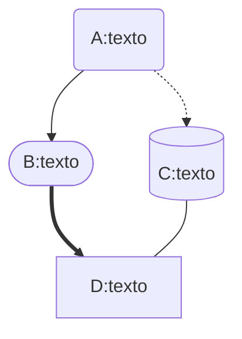

# XI Encontro de Computação e Sistemas de Informação - ENCOSIS 2022


## Dia 1 | Mini-curso:

### Usando Typora no auxílio de documentação de software

O Typora é uma ferramenta simples e poderosa que auxilia no processo de documentação de software, aumentando a produtividade do desenvolvedor e a velocidade de edição de Markdowns. Ele remove a necessidade da janela de visualização, o alternador de modo, os símbolos de sintaxe do código fonte Markdown e todas as outras distrações desnecessárias. Em vez disso, ele fornece um recurso de visualização automática para ajudar o desenvolvedor a se concentrar apenas no conteúdo em si da documentação. Além disso, ainda incorpora várias tecnologias que incrementam o arsenal do desenvolvedor para melhorar a elaboração da explicação de seu software.

**Instrutor: Nilo Edson**

 [/nedson/](https://www.linkedin.com/in/nedson/)


### Objetivos

- Dia 1: Mostrar as funcionalidades e recursos do Typora;

- Dia 2: Mostrar o processo de documentação de um projeto real;


### Documentação de Software

**Importância:**

- Mito: *"software bem escrito não precisa ser documentado"*
  - Apenas os desenvolvedores possuem o controle do fonte e conhecimento sobre o código;
- **Documentar o software faz parte do desenvolvimento do produto**;
- Do Manifesto das Metodologias Ágeis:
  - `Software funcional > documentação abrangente`;
- **Avaliar e balancear o peso da importância da documentação**;


### Conteúdo de um projeto

```
repo / Project
	- <source code>
	- <platform dependent files>
	- <optional license files>
	- README.md
```

- `README.md` - Arquivo de documentação escrito em **Markdown**.


### Funcionalidades do Typora

* Referência *Markdown* oficial da ferramenta ([link](https://support.typora.io/Markdown-Reference/))

```
  Preview automático
+ atalhos no teclado
+ uso de temas customizados
+ exportação para PDF e HTML
```

Exportação para outros formatos (Word, OpenOffice, RTF, Epub, LaTeX e etc...) usando o [Pandoc](https://github.com/jgm/pandoc).

``` 
``` <Enter>
```

```
```


### Inserir tags HTML

```html
<div>
    <h1>
        Header 1
    </h1>
    <h2>
        Header 2
    </h2>
    <a>texto</a>
</div>
```

<div>
    <h1>
        Header 1
    </h1>
    <h2>
        Header 2
    </h2>
    <a>texto</a>
</div>


### Criar hyperlinks

```
[ENCOSIS 2022](https://doity.com.br/encosis2022)
<https://doity.com.br/encosis2022>
<a href="https://doity.com.br/encosis2022">ENCOSIS 2022</a>
```

[ENCOSIS 2022](https://doity.com.br/encosis2022)
<https://doity.com.br/encosis2022>
<a href="https://doity.com.br/encosis2022">ENCOSIS 2022</a>


### Estilos na linha

```
Vários estilos suportados: como **negrito**, *itálico*, `código`, emoji :smile:, ~~tachado~~, <u>sublinhado</u>, <mark>realce</mark> e etc.

---

> citação
```

Vários estilos suportados: como **negrito**, *itálico*, `código`, emoji :smile:, ~~tachado~~, <u>sublinhado</u>, <mark>realce</mark> e etc.

---

> citação


### Inserir imagens

```

```


```

```


### *Code fences*

- `C`:

````
``` c
#include <stdio.h>
void foo() {
    printf("Hello ENCOSIS 2022!\n");
}
```
````

``` c
#include <stdio.h>
void foo() {
    printf("Hello ENCOSIS 2022!\n");
}
```


- `Python`:

````
``` python
def foo():
    print("Hello ENCOSIS 2022!\n")
```
````

``` python
def foo():
    print("Hello ENCOSIS 2022!\n")
```


### Tabelas

```
| Version  | Date          | Description   | Author | Email   |
| -------- | ------------- | ------------- | ------ | ------- |
| 0.000001 | May 02, 2022 | First release | Me     | mail@me |
```

| Version  | Date         | Description   | Author | Email   |
| -------- | ------------ | ------------- | ------ | ------- |
| 0.000001 | May 02, 2022 | First release | Me     | mail@me |


### Listas

```
* item 1
- item 2
3. item 3
- [x] check
```

* item 1
- item 2
3. item 3
- [x] check


### Funções matemáticas

```
$$
x^n + y^n = z^n
$$
```

$$
x^n + y^n = z^n
$$

```latex
$$
\sqrt{x^2+1}
$$
```

$$
\sqrt{x^2+1}
$$


### Temas

* Temas disponíveis no próprio site ([link](https://theme.typora.com.cn/));
* Customização de temas também é possível ([link](https://theme.typora.com.cn/doc/Write-Custom-Theme/));


### O Mermaid no Typora

* **Permite criar diagramas e visualizações usando texto e código** ([link](https://mermaid-js.github.io/mermaid/#/README));
* Reduz o tempo, esforço e ferramentas necessárias para criar diagramas e gráficos modificáveis, resultando em conteúdo mais **inteligente** e **reutilizável**;
* Como uma **ferramenta de diagramação baseada em texto**, permite atualizações rápidas e torna a documentação muito mais fácil;
* Também pode ser incluído em **scripts de produção** e outras peças de código, conforme requisito;


### Fluxogramas

- Sintaxe básica ([link](https://mermaid-js.github.io/mermaid/#/./flowchart?id=flowcharts-basic-syntax));

````

````




### Diagramas de sequência

- Sintaxe básica ([link](https://mermaid-js.github.io/mermaid/#/./sequenceDiagram));

````

````


### Diagrama de estados

- Sintaxe básica ([link](https://mermaid-js.github.io/mermaid/#/stateDiagram));

````

````


### Diagrama de Gantt

- Sintaxe básica ([link](https://mermaid-js.github.io/mermaid/#/./gantt));

````

````


### Diagrama de classe

- Sintaxe básica ([link](https://mermaid-js.github.io/mermaid/#/./classDiagram));

````

````


### Gráfico Git

- Sintaxe básica ([link](https://mermaid-js.github.io/mermaid/#/./gitgraph));

````

````


---


### Obrigado :smile:!


# XI Encontro de Computação e Sistemas de Informação - ENCOSIS 2022


## Dia 2 | Mini-curso:

### Usando Typora no auxílio de documentação de software

O Typora é uma ferramenta simples e poderosa que auxilia no processo de documentação de software, aumentando a produtividade do desenvolvedor e a velocidade de edição de Markdowns. Ele remove a necessidade da janela de visualização, o alternador de modo, os símbolos de sintaxe do código fonte Markdown e todas as outras distrações desnecessárias. Em vez disso, ele fornece um recurso de visualização automática para ajudar o desenvolvedor a se concentrar apenas no conteúdo em si da documentação. Além disso, ainda incorpora várias tecnologias que incrementam o arsenal do desenvolvedor para melhorar a elaboração da explicação de seu software.

**Instrutor: Nilo Edson**

 [/nedson/](https://www.linkedin.com/in/nedson/)


### Referências

- AMBLER, Scott W. *"Agile Modeling: Effective Practices for eXtreme Programming and the Unified Process"*. *Capítulo 14*. Wiley, 2002.
- RUPING, Andreas. *"Agile Documentation: A Pattern Guide to Producing Lightweight Documents for Software Projects"*. Wiley, 2003.
- ETTER, Andrew. *"Modern Technical Writing: An Introduction to Software Documentation"*. Kindle, 2019.
- MAYER, Christian. *"The Art of Clean Code: Best Practices to Eliminate Complexity and Simplify Your Life"*. *Capítulo 4*. Kindle, 2022.

<div align="center">
    
    
    
    
</div>


### Do Manifesto Ágil

| Esquerda                    | >    | Direita                                |
| --------------------------- | ---- | -------------------------------------- |
| **Indivíduos e Interações** | >    | <mark>Processos e Ferramentas</mark>   |
| **Software funcional**      | >    | <mark>Documentação compreensiva</mark> |
| **Colaboração do cliente**  | >    | Negociação por contrato                |
| **Resposta à mudança**      | >    | Seguir um plano                        |

Os valores do lado esquerdo pesam muito mais que os valores do lado direito. E logo nota-se que o processo de documentação compreende os dois primeiros pontos do lado direito. Portanto, decidir usar a ferramenta Typora não pode suprimir as necessidades dos desenvolvedores e suas interações e, tampouco, comprometer o esforço do processo de desenvolvimento no código da solução.

Mas isso **não torna o processo de documentação menos importante** (como já visto durante o dia 1 do minicurso).


### Documentação Ágil


**Como saber o que incluir no documento da solução?** <mark>Sabendo o que não precisa constar nele.</mark>

Como desenvolvedores, sempre **gastamos mais tempo criando modelos, arquiteturas, relações de entidades e lendo códigos do que os escrevendo propriamente**. Por isso, **quaisquer informações escritas no documento que ajudarem a acelerar esse processo de entendimento devem ser prioridade**.

Tudo o que puder **constar no código fonte que facilite sua leitura e compreensão** já **retira o peso do que precisa ser explicado no documento por escrito**. Assim, é imprescindível que alguns princípios básicos durante o desenvolvimento do código sejam seguidos.


### O Projeto real

**Módulo LoRaWAN End Device da Radioenge:**

- Página do produto no site da fabricante: ([link](https://www.radioenge.com.br/en/product/lorawan-module/));
- Documentação do dispositivo: ([link](https://www.radioenge.com.br/storage/2021/08/manual-lorawan-2021.pdf)).

<div align="center">
    
    
</div>
- Realizar a comunicação e integração entre uma SoC (System on Chip) e este módulo.

- O dispositivo utiliza uma interface UART para comunicação através de comandos AT.

```
TXD:-----------------------AT\r\n--------------------------------------
    <preparação do comando>      <processamento da resposta>
RXD:--------------------------------------------------------AT_OK\r\n--
```


---


### Clean Code como Documentação

**Alguns princípios básicos:**

1. Pense nos elementos do projeto como grandes blocos;
2. Escreva código para pessoas, não máquinas;
3. Siga padrões de estilo e seja consistente;
4. Use comentários de forma inteligente;
5. Evite surpresas, implemente o que se espera que aconteça;
6. Princípios da responsabilidade única e do menor conhecimento;
7. Desenvolva testes, mas procure facilitá-los.


---


**Como o código pode conter documentação seguindo os princípios básicos apresentados:**


Convém pensar no módulo LoRaWAN End Device como um grande bloco que precisa ser desenvolvido. Logo, espera-se a criação de uma classe e/ou biblioteca que se encarregue especificamente de implementar os métodos e funções necessárias para lidar com a comunicação direta com o módulo. Assim, o **princípio 1** é atendido. 

No exemplo da imagem, várias coisas podem ser observadas.

O **princípio 3** pode ser observado ao observar o padrão dos nomes de classe e métodos utilizados (padrão no mercado) com classes iniciando em maiúsculas e métodos iniciando com minúsculas. Pode-se observar o padrão de usar um "e" minúsculo precedendo os nomes nas enumerações. Fora isso, o padrão dos comentários usando [doxygen](https://www.doxygen.nl/index.html) ainda é outra convenção que se mistura com o **princípio 2** sobre escrever para humanos (e não máquinas) e o **princípio 4** sobre o uso inteligente de comentários.

Perceba que o nome `setDatarate` descreve exatamente o que a função faz. E escolher bons nomes de variáveis e funções também auxilia na leitura e análise do código por um outro humano. Nota-se também a tentativa de manter uma alta correlação entre o datasheet do módulo e a implementação no código fonte. A enumeração `eNJS` na documentação guarda "0" para representar que o dispositivo está desconectado e "1" caso contrário. A ordem escrita na enumeração segue exatamente esse padrão documentado e, portanto, não foi algo decidido arbitrariamente durante a implementação. 

> A correlação entre documentações deve ser a maior possível.

Outra decisão tomada foi usar uma nomenclatura familiar na função `setDatarate()` e em seu escopo usar uma nomenclatura que exprime exatamente o que a função deve fazer com `send_AT_DR()` pois, é exatamente isso que a função deve fazer: enviar um `AT+DR=<datarate>` pela interface serial, na comunicação com o módulo. 

A facilidade que o uso do doxygen traz pode ser visto na imagem. Ao passar o mouse ou selecionar o nome da função, uma janela aparece com uma descrição mais detalhada sobre ela que foi definida pelo próprio comentário adicionado na implementação da função.

```c++
/**
 * @brief Set datarate to be used by the End Device.
 * 
 * @param datarate identifier
 * @return LoRaWAN::eStatus 
 */
LoRaWAN::eStatus LoRaWAN::setDatarate(LoRaWAN::eDR datarate)
{
    return this->send_AT_DR(datarate, LORAWAN_DEFAULT_TIMEOUT);
}
```

Além disso, o comentário sobre a enumeração `eDR` traz mais facilmente o que cada um dos valores significa. Dessa forma, podemos trazer para o código também algo definido na documentação do datasheet do módulo de maneira mais fácil para o desenvolvedor que estiver lendo o código fonte, evitando que ele perca tempo precioso indo buscar informações no datasheet do módulo para saber do que se trata o código ali implementado.

O **princípio 6** permeia a abordagem utilizada para o desenvolvimento da classe. Ela sendo autocontida, não precisando de dependências externas ou não interferindo no funcionamento de outros blocos da solução, garante que ela pode ser retirada da aplicação geral como um todo sem afetar o funcionamento da solução. Da mesma forma, outras instâncias da mesma classe podem ser usadas para se comunicar com diferentes módulos se fosse necessário na solução. Pensar nas possibilidades de expansão ou portabilidade da solução é essencial para diminuir o tempo de implementação de outros projetos que utilizem o mesmo módulo, pois já existiria uma classe para sua devida utilização e bastaria levar os arquivos da classe para esse outro projeto.

O **princípio 7** pode ser observado no exemplo também. Perceba que o retorno das funções estão contidos na definição de uma enumeração `LoRaWAN::eStatus`, logo, a imagem da função está contida dentro de um escopo limitado de valores conforme essa mesma enumeração. Assim, não é preciso se preocupar com retornos inesperados e temos capilaridade suficiente para tratar cada retorno definido pela enumeração. Da mesma forma, o parâmetro passado pela função está contido na definição de uma enumeração `LoRaWAN::eDR` e, logo, o domínio da função também está contido dentro de um escopo limitado de valores. Assim, não é preciso tratar os valores dos argumentos  que são passados para a função. Isso diminui drasticamente os casos espúrios que poderiam afetar o funcionamento correto da função. 


### Documentando modelos

**Informações importantes a serem compartilhadas:**

1. Objetivo geral da implementação desenvolvida;
2. Descrição da arquitetura de software utilizada;
3. Princípio básico da funcionalidade dos componentes envolvidos;
4. Dependências utilizadas para o correto funcionamento da solução;
5. Referências utilizadas para o desenvolvimento;
6. Instruções de como expandir as funcionalidades da solução;
7. Referências utilizadas para o desenvolvimento.


---


**Diagrama de classe (simplificado):**


---


**Diagrama de sequência da solução:**


O **princípio 5** mostrado na seção anterior pode ser visto nesse exemplo. O que se espera que seja implementado é exatamente o que o modelo apresentado no diagrama de sequência descreve. E na implementação da função abaixo pode-se perceber quase uma correlação direta do documentado para o implementado no código fonte. E esse é o resultado esperado.


```c++
LoRaWAN::eStatus LoRaWAN::send_AT_DR(LoRaWAN::eDR datarate, uint32_t timeout)
{
    LoRaWAN::eStatus status;
    String payload = String(datarate);

    status = this->sendAtCommand(AT::DR, AT::SET, payload);

    if (status == LoRaWAN::UART_ISSUE) return status;

    status = this->waitResponse(timeout);

    if (status == LoRaWAN::NO_RESPONSE) return status;

    if (!this->buffer.compareTo(at.getResponse(AT::OK))) return LoRaWAN::OK;
    if (!this->buffer.compareTo(at.getResponse(AT::ERROR))) return LoRaWAN::ERROR;

    return LoRaWAN::UNEXPECTED;
}
```


---


### Obrigado :smile:!
