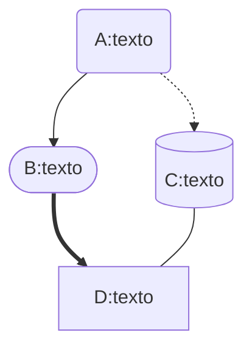
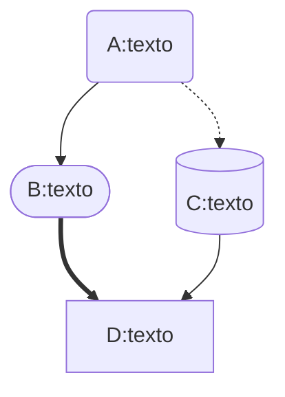
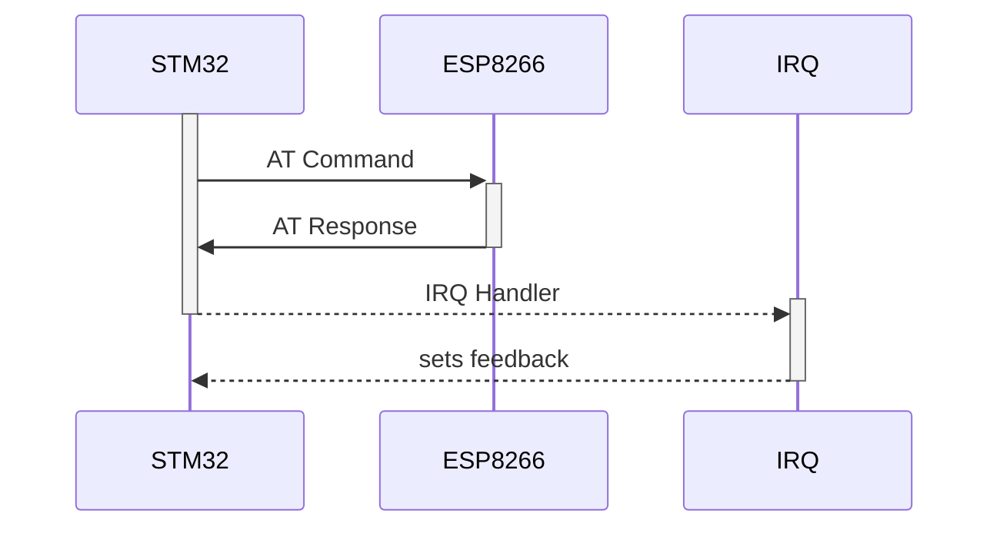
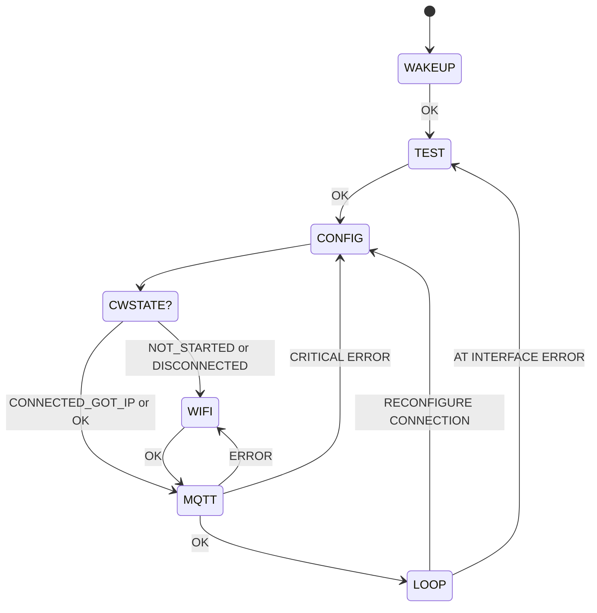
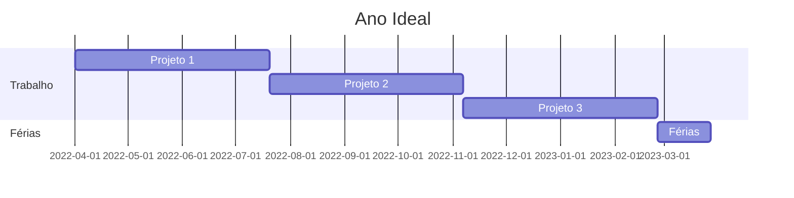
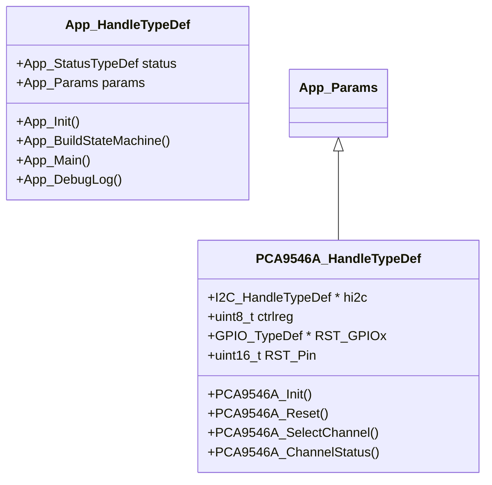

# XI Encontro de Computação e Sistemas de Informação - ENCOSIS 2022


## Dia 1 | Mini-curso:

### Usando Typora no auxílio de documentação de software

O Typora é uma ferramenta simples e poderosa que auxilia no processo de documentação de software, aumentando a produtividade do desenvolvedor e a velocidade de edição de Markdowns. Ele remove a necessidade da janela de visualização, o alternador de modo, os símbolos de sintaxe do código fonte Markdown e todas as outras distrações desnecessárias. Em vez disso, ele fornece um recurso de visualização automática para ajudar o desenvolvedor a se concentrar apenas no conteúdo em si da documentação. Além disso, ainda incorpora várias tecnologias que incrementam o arsenal do desenvolvedor para melhorar a elaboração da explicação de seu software.

**Instrutor: Nilo Edson**

<div>
    
    <a src="https://www.linkedin.com/in/nedson/">/in/nedson/</a>
</div>


### Objetivos

1. Mostrar as funcionalidades e recursos do Typora;
2. Mostrar o processo de documentação de um projeto real;


### Documentação de Software

**Importância:**

- Mito: *"software bem escrito não precisa ser documentado"*
  - Apenas os desenvolvedores possuem o controle do fonte e conhecimento sobre o código;
- **Documentar o software faz parte do desenvolvimento do produto**;
- Do Manifesto das Metodologias Ágeis:
  - `Software funcional > documentação abrangente`;
- **Avaliar e balancear o peso da importância da documentação**;


### Conteúdo de um projeto

```
repo / Project
	- <source code>
	- <platform dependent files>
	- <optional license files>
	- README.md
```

- `README.md` - Arquivo de documentação escrito em **Markdown**.


### Funcionalidades do Typora

* Referência *Markdown* oficial da ferramenta ([link](https://support.typora.io/Markdown-Reference/))

```
  Preview automático
+ atalhos no teclado
+ uso de temas customizados
+ exportação para PDF e HTML
```

Exportação para outros formatos (Word, OpenOffice, RTF, Epub, LaTeX e etc...) usando o [Pandoc](https://github.com/jgm/pandoc).

``` 
``` <Enter>
```

```
Olá, ENCOSIS 2022!
```


### Inserir tags HTML

```html
<div>
    <h1>
        Header 1
    </h1>
    <h2>
        Header 2
    </h2>
    <a>texto</a>
</div>
```

<div>
    <h1>
        Header 1
    </h1>
    <h2>
        Header 2
    </h2>
    <a>texto</a>
</div>


### Criar hyperlinks

```
[ENCOSIS 2022](https://doity.com.br/encosis2022)
<https://doity.com.br/encosis2022>
<a href="https://doity.com.br/encosis2022">ENCOSIS 2022</a>
```

[ENCOSIS 2022](https://doity.com.br/encosis2022)

<https://doity.com.br/encosis2022>

<a href="https://doity.com.br/encosis2022">ENCOSIS 2022</a>


### Estilos na linha

```
Vários estilos suportados: como **negrito**, *itálico*, `código`, emoji :smile:, ~~tachado~~, <u>sublinhado</u>, <mark>realce</mark> e etc.

---

> citação
```

Vários estilos suportados: como **negrito**, *itálico*, `código`, emoji :smile:, ~~tachado~~, <u>sublinhado</u>, <mark>realce</mark> e etc.

---

> citação


### Inserir imagens

```

```


```

```


### *Code fences*

- `C`:

````
``` c
#include <stdio.h>
void foo() {
    printf("Hello ENCOSIS 2022!\n");
}
```
````

```c
#include <stdio.h>
void foo() {
    printf("Hello ENCOSIS 2022!\n");
}
```


- `Python`:

````
``` python
def foo():
    print("Hello ENCOSIS 2022!\n")
```
````

``` python
def foo():
    print("Hello ENCOSIS 2022!\n")
```


### Tabelas

```
| Version  | Date          | Description   | Author | Email   |
| -------- | ------------- | ------------- | ------ | ------- |
| 0.000001 | April 08, 2022 | First release | Me     | mail@me |
```

| Version   | Date           | Description   | Author | EMail   |
| --------- | -------------- | ------------- | ------ | ------- |
| 0.0000001 | April 08, 2022 | First Release | Me     | mail@me |


### Listas

```
* item 1
- item 2
3. item 3
- [x] check
```

* item 1
- item 2
3. item 3
- [x] check


### Funções matemáticas

```
$$
x^n + y^n = z^n
$$
```

$$
x^n + y^n = z^n
$$


```latex
$$
\sqrt{x^2+1}
$$
```

$$
\sqrt{x^2+1}
$$


### Temas

* Temas disponíveis no próprio site ([link](https://theme.typora.com.cn/));
* Customização de temas também é possível ([link](https://theme.typora.com.cn/doc/Write-Custom-Theme/));


### O Mermaid no Typora

* **Permite criar diagramas e visualizações usando texto e código** ([link](https://mermaid-js.github.io/mermaid/#/README));
* Reduz o tempo, esforço e ferramentas necessárias para criar diagramas e gráficos modificáveis, resultando em conteúdo mais **inteligente** e **reutilizável**;
* Como uma **ferramenta de diagramação baseada em texto**, permite atualizações rápidas e torna a documentação muito mais fácil;
* Também pode ser incluído em **scripts de produção** e outras peças de código conforme requisito;


### Fluxogramas

- Sintaxe básica ([link](https://mermaid-js.github.io/mermaid/#/./flowchart?id=flowcharts-basic-syntax));

````

````




### Diagramas de sequência

- Sintaxe básica ([link](https://mermaid-js.github.io/mermaid/#/./sequenceDiagram));

````

````


### Diagrama de estados

- Sintaxe básica ([link](https://mermaid-js.github.io/mermaid/#/stateDiagram));

````

````


### Diagrama de Gantt

- Sintaxe básica ([link](https://mermaid-js.github.io/mermaid/#/./gantt));

````

````


### Diagrama de classe

- Sintaxe básica ([link](https://mermaid-js.github.io/mermaid/#/./classDiagram));

````

````


### Gráfico Git

- Sintaxe básica ([link](https://mermaid-js.github.io/mermaid/#/./gitgraph));

````
``` mermaid
gitGraph:
commit
branch newbranch
checkout newbranch
commit
checkout master
commit
merge newbranch
```
````

``` mermaid
gitGraph:
commit
branch newbranch
checkout newbranch
commit
checkout master
commit
merge newbranch
```


---


### Obrigado :smile:!


