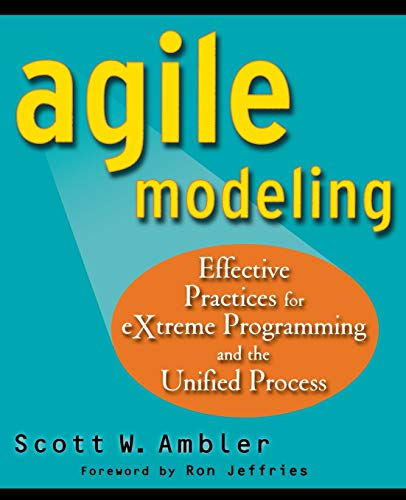
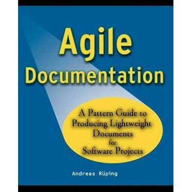
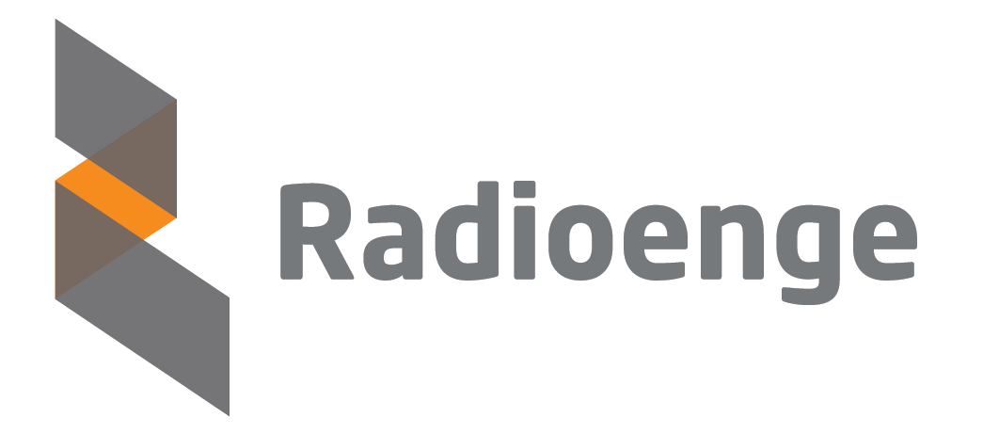

# XI Encontro de Computação e Sistemas de Informação - ENCOSIS 2022


## Dia 2 | Mini-curso:

### Usando Typora no auxílio de documentação de software

O Typora é uma ferramenta simples e poderosa que auxilia no processo de documentação de software, aumentando a produtividade do desenvolvedor e a velocidade de edição de Markdowns. Ele remove a necessidade da janela de visualização, o alternador de modo, os símbolos de sintaxe do código fonte Markdown e todas as outras distrações desnecessárias. Em vez disso, ele fornece um recurso de visualização automática para ajudar o desenvolvedor a se concentrar apenas no conteúdo em si da documentação. Além disso, ainda incorpora várias tecnologias que incrementam o arsenal do desenvolvedor para melhorar a elaboração da explicação de seu software.

**Instrutor: Nilo Edson**

<div>
    
    <a src="https://www.linkedin.com/in/nedson/">/in/nedson/</a>
</div>


### Referências

- AMBLER, Scott W. *"Agile Modeling: Effective Practices for eXtreme Programming and the Unified Process"*. *Capítulo 14*. Wiley, 2002.
- RUPING, Andreas. *"Agile Documentation: A Pattern Guide to Producing Lightweight Documents for Software Projects"*. Wiley, 2003.
- ETTER, Andrew. *"Modern Technical Writing: An Introduction to Software Documentation"*. Kindle, 2019.
- MAYER, Christian. *"The Art of Clean Code: Best Practices to Eliminate Complexity and Simplify Your Life"*. *Capítulo 4*. Kindle, 2022.

<div align="center">
    
    
    
    
</div>


### Do Manifesto Ágil

| Esquerda                    | >    | Direita                                |
| --------------------------- | ---- | -------------------------------------- |
| **Indivíduos e Interações** | >    | <mark>Processos e Ferramentas</mark>   |
| **Software funcional**      | >    | <mark>Documentação compreensiva</mark> |
| **Colaboração do cliente**  | >    | Negociação por contrato                |
| **Resposta à mudança**      | >    | Seguir um plano                        |


### Documentação Ágil


### Clean Code como Documentação

**Alguns princípios básicos:**

1. Pense nos elementos do projeto como grandes blocos;
2. Escreva código para pessoas, não máquinas;
3. Siga padrões de estilo e seja consistente;
4. Use comentários de forma inteligente;
5. Evite surpresas, implemente o que se espera que aconteça;
6. Princípios da responsabilidade única e do menor conhecimento;
7. Desenvolva testes, mas procure facilitá-los.


---


**Módulo LoRaWAN EndDevice da Radioenge:**


<div align="center">
    
    
</div>


```
TXD:-----------------------AT\r\n--------------------------------------
    <preparação do comando>      <processamento da resposta>
RXD:--------------------------------------------------------AT_OK\r\n--
```


---


---


```c++
/**
 * @brief Set datarate to be used by the End Device.
 * 
 * @param datarate identifier
 * @return LoRaWAN::eStatus 
 */
LoRaWAN::eStatus LoRaWAN::setDatarate(LoRaWAN::eDR datarate)
{
    return this->send_AT_DR(datarate, LORAWAN_DEFAULT_TIMEOUT);
}
```


---


### Documentando modelos

**Informações importantes a serem compartilhadas:**

1. Objetivo geral da implementação desenvolvida;
2. Descrição da arquitetura de software utilizada;
3. Princípio básico da funcionalidade dos componentes envolvidos;
4. Dependências utilizadas para o correto funcionamento da solução;
5. Referências utilizadas para o desenvolvimento;
6. Instruções de como expandir as funcionalidades da solução;
7. Referências utilizadas para o desenvolvimento.


---


---


---


```c++
LoRaWAN::eStatus LoRaWAN::send_AT_DR(LoRaWAN::eDR datarate, uint32_t timeout)
{
    LoRaWAN::eStatus status;
    String payload;

    switch (datarate)
    {
    case LoRaWAN::DR0: payload = "0"; break;
    case LoRaWAN::DR1: payload = "1"; break;
    case LoRaWAN::DR2: payload = "2"; break;
    case LoRaWAN::DR3: payload = "3"; break;
    case LoRaWAN::DR4: payload = "4"; break;
    case LoRaWAN::DR5: payload = "5"; break;
    case LoRaWAN::DR6: payload = "6"; break;
    default: payload = "0"; break;
    }

    status = this->sendAtCommand(AT::DR, AT::SET, payload);

    if (status == LoRaWAN::ERROR) return status;

    status = this->waitResponse(timeout);

    if (status == LoRaWAN::NO_RESPONSE) return status;

    if (!this->buffer.compareTo(_at.getResponse(AT::OK))) return LoRaWAN::OK;

    return LoRaWAN::UNEXPECTED;
}
```


---


### Obrigado :smile:!


